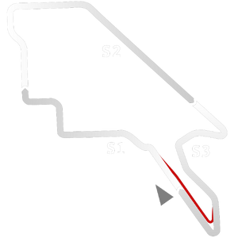

# 🏁 Track Info

---

---

## 📊 Specifications

- **Name**: Adelaide_Historic
- **PitSpeedLimit_HighKPH**: 60
- **Max AI participants**: 25
- **Race_Date_Year**: 1988
- **Track_Climate**: se_australia
- **Track Surface**: Tarmac
- **Track Type**: Circuit
- **Race_Date_Month**: 11
- **Race_Date_Day**: 13
- **TrackGradeFilter**: Historic
- **Number Of Turns**: 16
- **Track_TimeZone**: 10.5
- **Track_Altitude**: 52
- **Length**: 3780
- **DLC ID**: 
- **Location**: Australia
- **Recommended classes**: Formula Classic (G1,G2,G3,G4)Formula HiTech (G1,G2)Formula V12
