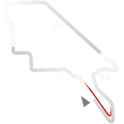
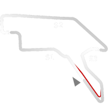
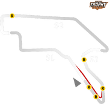

# 🏁 Track Info

Adelaideis an Australian track location. It is the capital and largest city of South Australia, and the fifth-most populous city in Australia.[1]TheAdelaide Street Circuit(also known as theAdelaide Parklands Circuit) is a temporary street circuit in the East Parklands adjacent to the Adelaide central business district.[2]

---

---

