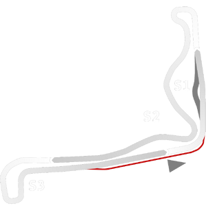

# 🏁 Track Info

---

---

## 📊 Specifications

- **Name**: Ascurra_Dirt
- **PitSpeedLimit_HighKPH**: 60
- **Max AI participants**: 15
- **Race_Date_Year**: 2022
- **Track_Climate**: south_america
- **Track Surface**: mud
- **Track Type**: Rallycross
- **Race_Date_Month**: 9
- **Race_Date_Day**: 28
- **TrackGradeFilter**: OffRoad
- **Number Of Turns**: 8
- **Track_TimeZone**: -3
- **Track_Altitude**: 88
- **Length**: 910
- **DLC ID**: adrenalinept1pack
- **Location**: Brazil
- **Recommended classes**: Formula DirtKartcrossRallycross
