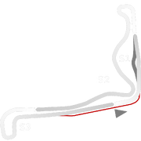
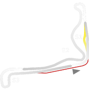

# 🏁 Track Info

Ascurrais a Brazilian track location, and a municipality in the Santa Catarina state of Brazil. The track itself is known asAutódromo Max Mohr, named after Brazilian race driver, Max Mohr, who is an accomplished driver from Santa Catarina, and winner of the Brazilian Velocidade na Terra championship in 2001.[1]

---

---

