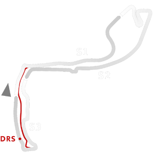

# 🏁 Track Info

---

---

## 📊 Specifications

- **Name**: Azure_Circuit_2021
- **PitSpeedLimit_HighKPH**: 60
- **Max AI participants**: 25
- **Race_Date_Year**: 2021
- **Track_Climate**: mediterranean
- **Track Surface**: Tarmac
- **Track Type**: Circuit
- **Race_Date_Month**: 5
- **Race_Date_Day**: 23
- **TrackGradeFilter**: Grade1
- **Number Of Turns**: 19
- **Track_TimeZone**: 2
- **Track_Altitude**: 1.57
- **Is Clockwise**: TRUE
- **Length**: 3337
- **DLC ID**: 
- **Location**: Monaco
- **Recommended classes**: Any Formula classCarrera Cup
