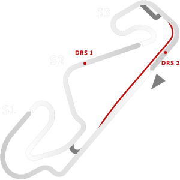

# 🏁 Track Info

---

---

## 📊 Specifications

- **Name**: Circuit_de_Catalunya_GP_NC
- **PitSpeedLimit_HighKPH**: 60
- **Max AI participants**: 31
- **Race_Date_Year**: 2022
- **Track_Climate**: europe
- **Track Surface**: Tarmac
- **Track Type**: Circuit
- **Race_Date_Month**: 5
- **Race_Date_Day**: 22
- **TrackGradeFilter**: Grade1
- **Number Of Turns**: 14
- **Track_TimeZone**: 1
- **Track_Altitude**: 115
- **Length**: 4657
- **DLC ID**: barcelonapack
- **Location**: Spain
- **Recommended classes**: Formula Ultimate Gen2GTEGT3 Gen2GT4Carrera Cup
