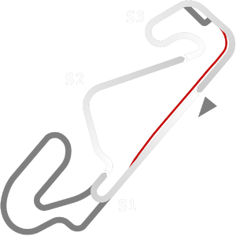

# 🏁 Track Info

---

---

## 📊 Specifications

- **Layout**: Circuit de Barcelona-Catalunya  National
- **Pit speed limit(KPH)**: 60
- **Max AI participants**: 31
- **Default year**: 2022
- **Track Climate**: europe
- **Track Surface**: Tarmac
- **Track Type**: Circuit
- **Default month**: 5
- **Default day**: 22
- **Grade**: Grade 1
- **Number of turns**: 9
- **Track TimeZone**: 1
- **Altitude (Meter)**: 115
- **Is Clockwise**: 
- **Length (Meter)**: 2997
- **DLC**: Barcelona pack
- **Country**: Spain
- **Recommended classes**: Formula 3Carrera Cup
