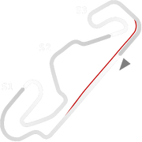
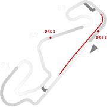
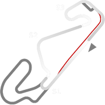
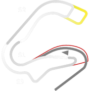

# 🏁 Track Info

Barcelonais a Spanish track location, and a city on the northeastern coast of Spain. It is the capital and largest city of the autonomous community of Catalonia, as well as the second-most populous municipality of Spain. TheCircuit de Barcelona-Catalunyais a 4.657 km (2.894 mi) motorsport race track in Montmeló, Barcelona, Catalonia, Spain.

---

---

