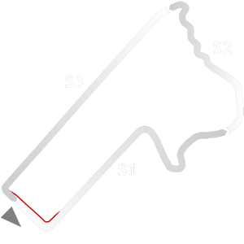

# 🏁 Track Info

---

---

## 📊 Specifications

- **Name**: Bathurst_1983
- **PitSpeedLimit_HighKPH**: 60
- **Max AI participants**: 31
- **Race_Date_Year**: 1983
- **Track_Climate**: se_australia
- **Track Surface**: Tarmac
- **Track Type**: Circuit
- **Race_Date_Month**: 2
- **Race_Date_Day**: 1
- **TrackGradeFilter**: Grade3
- **Number Of Turns**: 20
- **Track_TimeZone**: 10
- **Track_Altitude**: 780
- **Is Clockwise**: FALSE
- **Length**: 6171
- **DLC ID**: historicaltrackpt1pack
- **Location**: Australia
