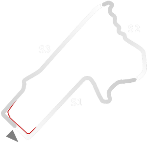

# 🏁 Track Info

---

---

## 📊 Specifications

- **Name**: Bathurst_2020
- **PitSpeedLimit_HighKPH**: 60
- **Max AI participants**: 35
- **Race_Date_Year**: 2020
- **Track_Climate**: se_australia
- **Track Surface**: Tarmac
- **Track Type**: Circuit
- **Race_Date_Month**: 2
- **Race_Date_Day**: 1
- **TrackGradeFilter**: Grade3
- **Number Of Turns**: 23
- **Track_TimeZone**: 10
- **Track_Altitude**: 780
- **Is Clockwise**: FALSE
- **Length**: 6213
- **DLC ID**: 
- **Location**: Australia
- **Recommended classes**: Super V8Aussie Racing CarsGT3 (G1,G2)GT4
