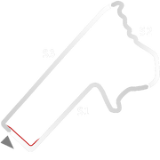
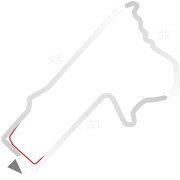

# 🏁 Track Info

Bathurstis an Australian track location and a city in the Central Tablelands of New South Wales, Australia. It is the oldest inland settlement in Australia and also contains theMount Panorama Circuit.[1]

---

---

