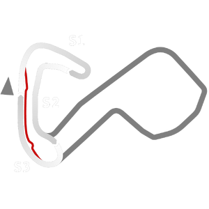

# 🏁 Track Info

---

---

## 📊 Specifications

- **Name**: BrandsHatch
- **PitSpeedLimit_HighKPH**: 60
- **Max AI participants**: 31
- **Race_Date_Year**: 2020
- **Track_Climate**: England
- **Track Surface**: Tarmac
- **Track Type**: Circuit
- **Race_Date_Month**: 6
- **Race_Date_Day**: 11
- **TrackGradeFilter**: 2
- **Number Of Turns**: 5
- **Track_TimeZone**: 1
- **Track_Altitude**: 177.57
- **Length**: 1944
- **DLC ID**: 
- **Location**: England
