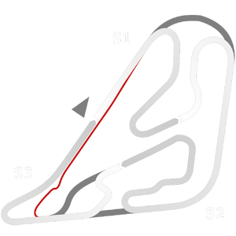

# 🏁 Track Info

---

---

## 📊 Specifications

- **Name**: Buenos_Aires_Circuito_6T
- **PitSpeedLimit_HighKPH**: 60
- **Max AI participants**: 31
- **Race_Date_Year**: 2020
- **Track_Climate**: south_america
- **Track Surface**: Tarmac
- **Track Type**: Circuit
- **Race_Date_Month**: 2
- **Race_Date_Day**: 20
- **TrackGradeFilter**: Grade1
- **Number Of Turns**: 17
- **Track_TimeZone**: -3
- **Track_Altitude**: 10
- **Is Clockwise**: FALSE
- **Length**: 4259
- **DLC ID**: 
- **Location**: Argentina
