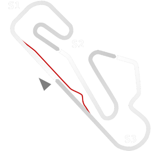

# 🏁 Track Info

---

---

## 📊 Specifications

- **Name**: Cascais_1988
- **PitSpeedLimit_HighKPH**: 60
- **Max AI participants**: 29
- **Race_Date_Year**: 1988
- **Track_Climate**: europe
- **Track Surface**: Tarmac
- **Track Type**: Circuit
- **Race_Date_Month**: 9
- **Race_Date_Day**: 25
- **TrackGradeFilter**: Grade1
- **Number Of Turns**: 11
- **Track_TimeZone**: 0
- **Track_Altitude**: 130
- **Length**: 4350
- **DLC ID**: historicaltrackpt1pack
- **Location**: Portugal
