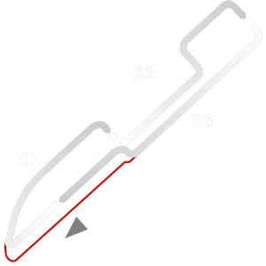

# 🏁 Track Info

---

---

## 📊 Specifications

- **Name**: Cleveland_GP
- **PitSpeedLimit_HighKPH**: 60
- **Max AI participants**: 31
- **Race_Date_Year**: 2020
- **Track_Climate**: north_usa
- **Track Surface**: Tarmac
- **Track Type**: Circuit
- **Race_Date_Month**: 6
- **Race_Date_Day**: 5
- **TrackGradeFilter**: Alt
- **Number Of Turns**: 10
- **Track_TimeZone**: -4
- **Track_Altitude**: 199
- **Is Clockwise**: TRUE
- **Length**: 3389
- **DLC ID**: racinusapt2pack
- **Location**: USA
