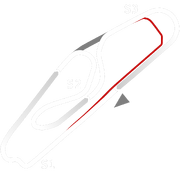
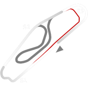

# 🏁 Track Info

Curitibais a Brazilian track location, and the capital and largest city in the state of Paraná in Southern Brazil. TheAutódromo Internacional de Curitiba(Curitiba International Raceway) is located in nearby Pinhais.[1]

---

---

