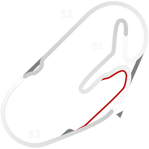

# 🏁 Track Info

---

---

## 📊 Specifications

- **Name**: Daytona_Road_Course
- **PitSpeedLimit_HighKPH**: 100
- **Max AI participants**: 31
- **Race_Date_Year**: 2021
- **Track_Climate**: daytona
- **Track Surface**: Tarmac
- **Track Type**: Circuit
- **Race_Date_Month**: 2
- **Race_Date_Day**: 4
- **TrackGradeFilter**: Grade3
- **Number Of Turns**: 12
- **Track_TimeZone**: -5
- **Track_Altitude**: 9.039
- **Is Clockwise**: FALSE
- **Length**: 5729
- **DLC ID**: racinusapt1pack
- **Location**: USA
