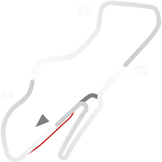
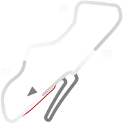

# 🏁 Track Info

Donington Parkis a motorsport circuit located near Castle Donington in Leicestershire, England. The circuit business is now owned by Jonathan Palmer's MotorSport Vision organisation, and the surrounding Donington Park Estate, still owned by the Wheatcroft family, is currently under lease by MotorSport Vision until 2038. It has a capacity of 120,000.[1]

---

---

