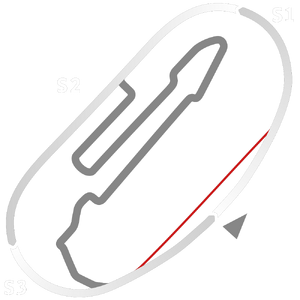

# 🏁 Track Info

---

---

## 📊 Specifications

- **Name**: Fontana_OVAL
- **PitSpeedLimit_HighKPH**: 60
- **Max AI participants**: 31
- **Race_Date_Year**: 2022
- **Track_Climate**: california
- **Track Surface**: Tarmac
- **Track Type**: Oval
- **Race_Date_Month**: 5
- **Race_Date_Day**: 30
- **TrackGradeFilter**: Grade2
- **Number Of Turns**: 4
- **Track_TimeZone**: -6
- **Track_Altitude**: 377
- **Is Clockwise**: FALSE
- **Length**: 3219
- **DLC ID**: racinusapt3pack
- **Location**: USA
