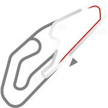
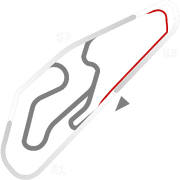

# 🏁 Track Info

Goiâniais a Brazilian track location, and the capital and largest city of the Brazilian state of Goiás. Goiânia has a racetrack, theAutódromo Internacional Ayrton Sennaand a kart track.[1]

---

---

