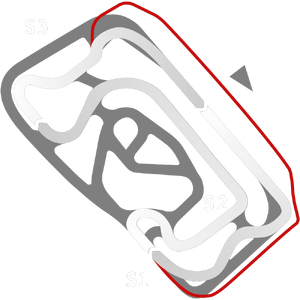

# 🏁 Track Info

---

---

## 📊 Specifications

- **Name**: GranjaVianaKart121
- **PitSpeedLimit_HighKPH**: 60
- **Max AI participants**: 27
- **Race_Date_Year**: 2020
- **Track_Climate**: South_America
- **Track Surface**: Tarmac
- **Track Type**: Kart
- **Race_Date_Month**: 5
- **Race_Date_Day**: 3
- **TrackGradeFilter**: Kart
- **Number Of Turns**: 11
- **Track_TimeZone**: 1
- **Track_Altitude**: 797
- **Length**: 800
- **DLC ID**: 
- **Location**: Brazil
