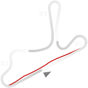
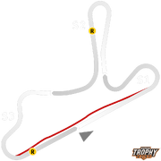

# 🏁 Track Info

Guaporéis a Brazilian track location, and a municipality located in the state of Rio Grande do Sul. It is home to theAutódromo Internacional de Guaporé.Aside from the many races held in the circuit over the year, the area also holds a kart racing track, a swimming pool, a camping area, and facilities for traditional Sunday barbecues and other activities.[1]

---

---

