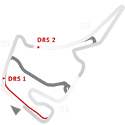
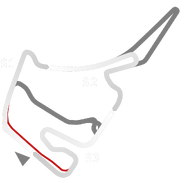
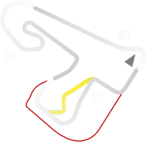
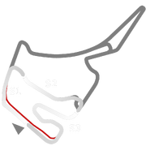
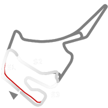
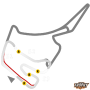

# 🏁 Track Info

TheHockenheimring Baden-Württembergis a motor racing circuit situated in the Rhine valley near the town of Hockenheim in Baden-Württemberg, Germany, located on the Bertha Benz Memorial Route. Amongst other motor racing events, it has hosted the German Formula 1 Grand Prix, most recently in 2019. The circuit is flat with very little differences in elevation. The circuit has an FIA Grade 1 licence.[1]

---

---

