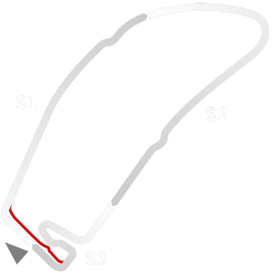

# 🏁 Track Info

---

---

## 📊 Specifications

- **Name**: Hockenheim_1977
- **PitSpeedLimit_HighKPH**: 60
- **Max AI participants**: 35
- **Race_Date_Year**: 1977
- **Track_Climate**: europe_farfog
- **Track Surface**: Tarmac
- **Track Type**: Circuit
- **Race_Date_Month**: 8
- **Race_Date_Day**: 31
- **TrackGradeFilter**: Historic
- **Number Of Turns**: 13
- **Track_TimeZone**: 1
- **Track_Altitude**: 102
- **Is Clockwise**: TRUE
- **Length**: 6789
- **DLC ID**: hockenheimpack
- **Location**: Germany
