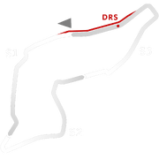

# 🏁 Track Info

Imolais an Italian track location and a city andcomunein the Metropolitan City of Bologna, located on the river Santerno, in the Emilia-Romagna region of northern Italy. The city is best-known as the home of theAutodromo Enzo e Dino Ferrariwhich hosts the Formula 1 Emilia Romagna Grand Prix and formerly hosted the San Marino Grand Prix, named after the independent nation of San Marino around 100 km to the south.[1]

---

---

