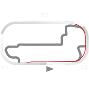
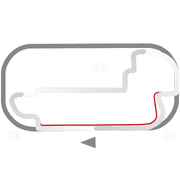

# 🏁 Track Info

Indianapolis, colloquially known asIndy, is a U.S. track location and the capital city of the U.S. state of Indiana. Indianapolis is a global center for auto racing, home to numerous motorsports facilities and events, two sanctioning bodies (INDYCAR and United States Auto Club), and more than 500 motorsports-related companies. The most famous among these is theIndianapolis Motor Speedway.[1]

---

---

