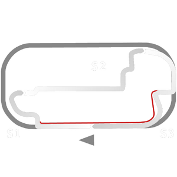

# 🏁 Track Info

---

---

## 📊 Specifications

- **Name**: Indianapolis_2022_RC
- **PitSpeedLimit_HighKPH**: 60
- **Max AI participants**: 31
- **Race_Date_Year**: 2022
- **Track_Climate**: north_usa
- **Track Surface**: Tarmac
- **Track Type**: Circuit
- **Race_Date_Month**: 5
- **Race_Date_Day**: 29
- **TrackGradeFilter**: Grade1
- **Number Of Turns**: 14
- **Track_TimeZone**: -5
- **Track_Altitude**: 220
- **Is Clockwise**: FALSE
- **Length**: 3925
- **DLC ID**: racinusapt3pack
- **Location**: USA
