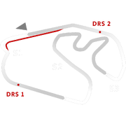
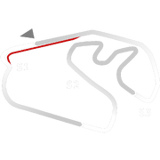
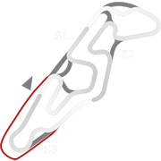
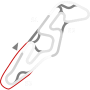
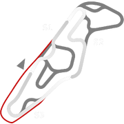
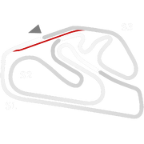
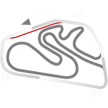
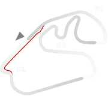

# 🏁 Track Info

Autódromo José Carlos Pace, better known asAutódromo de Interlagosor simplyInterlagos, is a 4.309 km (2.677 mi) motorsport circuit located in the city of São Paulo, Brazil. It has hosted the Formula 1 Brazilian Grand Prix since 1973.[1]

---

---

