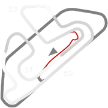
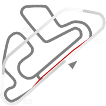
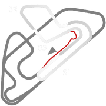
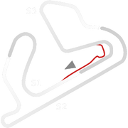

# 🏁 Track Info

Jacarepaguáis a Brazilian track location and a neighborhood situated in the West Zone of Rio de Janeiro, Brazil. It is home to theAutódromo de Jacarepaguá, which hosted the Formula 1 Brazilian Grand Prix between 1978 and 1989.

---

---

