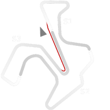
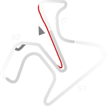
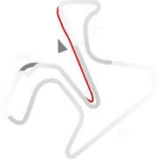

# 🏁 Track Info

Circuito de Jerez – Ángel Nieto(formerly known asCircuito de JerezandCircuito de Velocidad Jerez), is a 4.428 km (2.751 mi) racing circuit located close to the city of Jerez de la Frontera. On 3 May 2018, the circuit was renamed in honor of the former motorcyclist Ángel Nieto, who died in 2017.[1]

---

---

