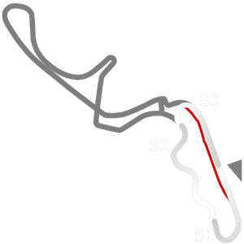

# 🏁 Track Info

---

---

## 📊 Specifications

- **Name**: Kansai
- **PitSpeedLimit_HighKPH**: 60
- **Max AI participants**: 51
- **Race_Date_Year**: 2020
- **Track_Climate**: Europe_farfog
- **Track Surface**: Tarmac
- **Track Type**: Circuit
- **Race_Date_Month**: 10
- **Race_Date_Day**: 5
- **TrackGradeFilter**: Alt
- **Number Of Turns**: 10
- **Track_TimeZone**: 9
- **Track_Altitude**: 47.188
- **Length**: 2243
- **DLC ID**: 
- **Location**: Japan
