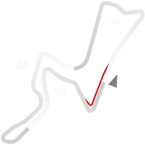
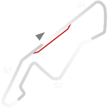

# 🏁 Track Info

Kyalami Grand Prix Circuit(fromKhaya lami,My homein Zulu) is a 4.529 km (2.814 mi) motor racing circuit located in Midrand, Gauteng, South Africa, just north of Johannesburg. The circuit has been used for Grand Prix and Formula One races and has hosted the South African Grand Prix twenty times.[1]

---

---

