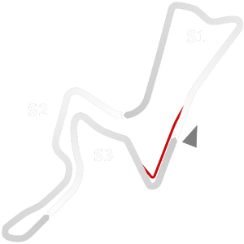

# 🏁 Track Info

---

---

## 📊 Specifications

- **Name**: Kyalami_2019
- **PitSpeedLimit_HighKPH**: 60
- **Max AI participants**: 39
- **Race_Date_Year**: 2020
- **Track_Climate**: south_usa
- **Track Surface**: Tarmac
- **Track Type**: Circuit
- **Race_Date_Month**: 4
- **Race_Date_Day**: 15
- **TrackGradeFilter**: Grade2
- **Number Of Turns**: 15
- **Track_TimeZone**: 2
- **Track_Altitude**: 1532
- **Is Clockwise**: FALSE
- **Length**: 4529
- **DLC ID**: 
- **Location**: South_Africa
