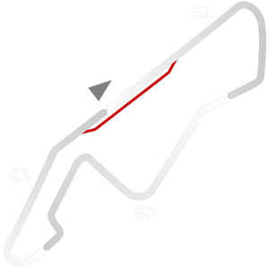

# 🏁 Track Info

---

---

## 📊 Specifications

- **Name**: Kyalami_Historic
- **PitSpeedLimit_HighKPH**: 60
- **Max AI participants**: 25
- **Race_Date_Year**: 1976
- **Track_Climate**: south_america
- **Track Surface**: Tarmac
- **Track Type**: Circuit
- **Race_Date_Month**: 3
- **Race_Date_Day**: 5
- **TrackGradeFilter**: Historic
- **Number Of Turns**: 9
- **Track_TimeZone**: 2
- **Track_Altitude**: 1532
- **Length**: 4048
- **DLC ID**: 
- **Location**: South_Africa
