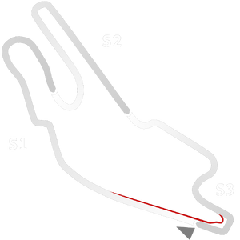

# 🏁 Track Info

---

---

## 📊 Specifications

- **Layout**: Le Mans Circuit Bugatti
- **Pit speed limit(KPH)**: 60
- **Max AI participants**: 31
- **Default year**: 2022
- **Track Climate**: europe
- **Track Surface**: Tarmac
- **Track Type**: Circuit
- **Default month**: 6
- **Default day**: 11
- **Grade**: Grade 2
- **Number of turns**: 14
- **Track TimeZone**: 1
- **Altitude (Meter)**: 52
- **Is Clockwise**: SANT
- **Length (Meter)**: 4185
- **DLC**: Le Mans pack
- **Country**: France
