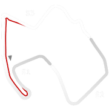

# 🏁 Track Info

Laguna Seca Raceway,also known asWeatherTech Raceway Laguna Seca, and previouslyMazda Raceway Laguna Seca, is a paved road racing track in central California used for both auto racing and motorcycle racing, built in 1957 near both Salinas and Monterey, California, United States.[1]

---

---

