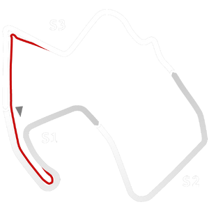

# 🏁 Track Info

---

---

## 📊 Specifications

- **Name**: Laguna_Seca_2020
- **PitSpeedLimit_HighKPH**: 60
- **Max AI participants**: 29
- **Race_Date_Year**: 2020
- **Track_Climate**: california
- **Track Surface**: Tarmac
- **Track Type**: Circuit
- **Race_Date_Month**: 8
- **Race_Date_Day**: 30
- **TrackGradeFilter**: Grade2
- **Number Of Turns**: 11
- **Track_TimeZone**: -6
- **Track_Altitude**: 220
- **Is Clockwise**: FALSE
- **Length**: 3602
- **DLC ID**: racinusapt1pack
- **Location**: USA
