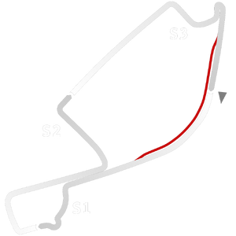

# 🏁 Track Info

---

---

## 📊 Specifications

- **Name**: Long_Beach
- **PitSpeedLimit_HighKPH**: 60
- **Max AI participants**: 31
- **Race_Date_Year**: 2020
- **Track_Climate**: california
- **Track Surface**: Tarmac
- **Track Type**: Circuit
- **Race_Date_Month**: 9
- **Race_Date_Day**: 15
- **TrackGradeFilter**: Grade3
- **Number Of Turns**: 11
- **Track_TimeZone**: -7
- **Track_Altitude**: 2
- **Is Clockwise**: TRUE
- **Length**: 3167
- **DLC ID**: racinusapt1pack
- **Location**: USA
