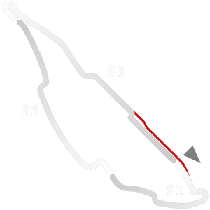

# 🏁 Track Info

---

---

## 📊 Specifications

- **Layout**: Montreal Historic 1991
- **Pit speed limit(KPH)**: 60
- **Max AI participants**: 39
- **Default year**: 1991
- **Track Climate**: north_usa
- **Track Surface**: Tarmac
- **Track Type**: Circuit
- **Default month**: 6
- **Default day**: 12
- **Grade**: Historic
- **Number of turns**: 16
- **Track TimeZone**: -5
- **Altitude (Meter)**: 13
- **Is Clockwise**: SANT
- **Length (Meter)**: 4430
- **DLC**: Historicaltrack pt2 pack
- **Country**: Canada
