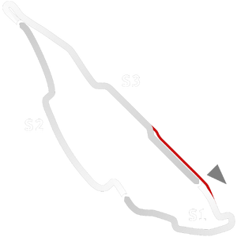

# 🏁 Track Info

---

---

## 📊 Specifications

- **Name**: Montreal_Historic
- **PitSpeedLimit_HighKPH**: 60
- **Max AI participants**: 39
- **Race_Date_Year**: 1988
- **Track_Climate**: north_usa
- **Track Surface**: Tarmac
- **Track Type**: Circuit
- **Race_Date_Month**: 6
- **Race_Date_Day**: 12
- **TrackGradeFilter**: Historic
- **Number Of Turns**: 16
- **Track_TimeZone**: -5
- **Track_Altitude**: 13
- **Is Clockwise**: TRUE
- **Length**: 4430
- **DLC ID**: 
- **Location**: Canada
