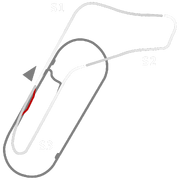
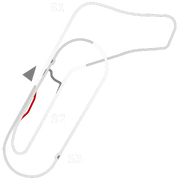
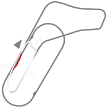
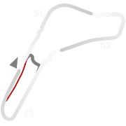
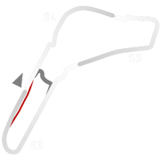
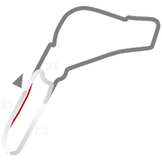
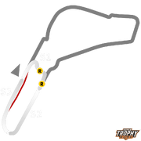

# 🏁 Track Info

TheMonza Circuitis a 5.793 km (3.600 mi) race track near the city of Monza, north of Milan, in Italy. Built in 1922, it was the world's third purpose-built motor racing circuit after Brooklands and Indianapolis and the oldest in mainland Europe, according to the circuit organizers. The circuit's biggest event is the Italian Grand Prix. With the exception of 1980 due to track renovations, the race has been hosted there since 1949.[1]

---

---

