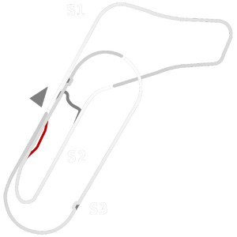

# 🏁 Track Info

---

---

## 📊 Specifications

- **Name**: Monza_1971_10k
- **PitSpeedLimit_HighKPH**: 60
- **Max AI participants**: 25
- **Race_Date_Year**: 1971
- **Track_Climate**: europe
- **Track Surface**: Tarmac
- **Track Type**: Circuit
- **Race_Date_Month**: 4
- **Race_Date_Day**: 25
- **TrackGradeFilter**: Grade1
- **Number Of Turns**: 16
- **Track_TimeZone**: 2
- **Track_Altitude**: 180
- **Is Clockwise**: TRUE
- **Length**: 10100
- **DLC ID**: monzapack
- **Location**: Italy
