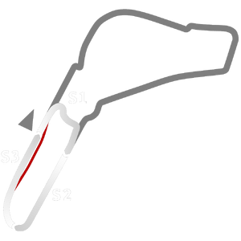

# 🏁 Track Info

---

---

## 📊 Specifications

- **Name**: Monza_2020_Junior
- **PitSpeedLimit_HighKPH**: 60
- **Max AI participants**: 31
- **Race_Date_Year**: 2020
- **Track_Climate**: europe
- **Track Surface**: Tarmac
- **Track Type**: Circuit
- **Race_Date_Month**: 4
- **Race_Date_Day**: 16
- **TrackGradeFilter**: Grade3
- **Number Of Turns**: 4
- **Track_TimeZone**: 2
- **Track_Altitude**: 180
- **Is Clockwise**: TRUE
- **Length**: 2405
- **DLC ID**: monzapack
- **Location**: Italy
