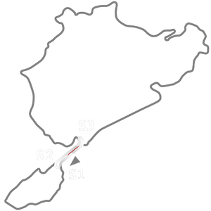

# 🏁 Track Info

---

---

## 📊 Specifications

- **Name**: Betonschleife Historic 1971
- **PitSpeedLimit_HighKPH**: 60
- **Max AI participants**: 31
- **Race_Date_Year**: 1971
- **Track_Climate**: europe
- **Track Surface**: Tarmac
- **Track Type**: Circuit
- **Race_Date_Month**: 7
- **Race_Date_Day**: 5
- **TrackGradeFilter**: Historic
- **Number Of Turns**: 
- **Track_TimeZone**: -6
- **Track_Altitude**: 397
- **Is Clockwise**: FALSE
- **Length**: 2391
- **DLC ID**: 
- **Location**: Germany
