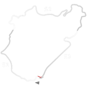
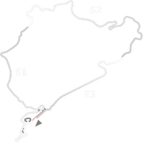
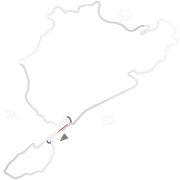
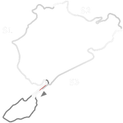
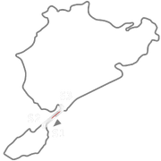
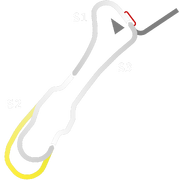
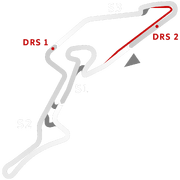
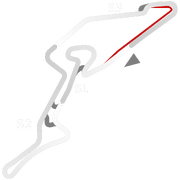

# 🏁 Track Info

TheNürburgringis a motorsports complex located in the town of Nürburg, Rhineland-Palatinate, Germany. It features a Grand Prix race track built in 1984, and a longNordschleife"North loop" track, built in the 1920s, around the village and medieval castle of Nürburg in the Eifel mountains. The north loop is 20.830 km (12.943 mi) long and contains more than 300 metres (1,000 feet) of elevation change from its lowest to highest points.[1]The Nordschleife 24H configuration is the longest purpose-built race track to exist today.

---

---

