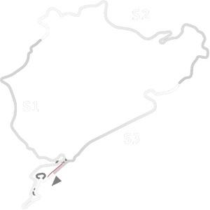

# 🏁 Track Info

---

---

## 📊 Specifications

- **Name**: Nordschleife_2020_24hr
- **PitSpeedLimit_HighKPH**: 60
- **Max AI participants**: 29
- **Race_Date_Year**: 2020
- **Track_Climate**: europe
- **Track Surface**: Tarmac
- **Track Type**: Circuit
- **Race_Date_Month**: 8
- **Race_Date_Day**: 1
- **TrackGradeFilter**: Grade3
- **Number Of Turns**: 88
- **Track_TimeZone**: 1
- **Track_Altitude**: 397
- **Is Clockwise**: TRUE
- **Length**: 25378
- **DLC ID**: nurburgringpack
- **Location**: Germany
