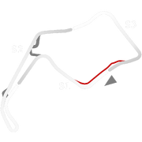
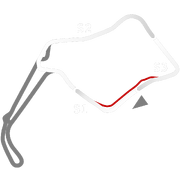
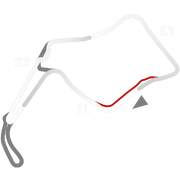

# 🏁 Track Info

Oulton Parkis a motor racing circuit located close to the village of Little Budworth, Cheshire, England. The full circuit is 2.692 mi (4.332 km). Oulton Park currently hosts the following major UK race championships - British Touring Car Championship, British GT Championship, British Superbike Championship & the GB3 Championship.[1]

---

---

