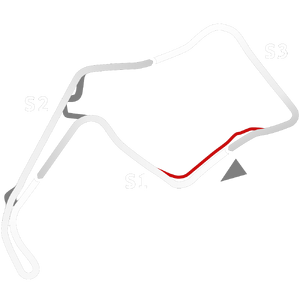

# 🏁 Track Info

---

---

## 📊 Specifications

- **Name**: OultonPark_Classic
- **PitSpeedLimit_HighKPH**: 60
- **Max AI participants**: 27
- **Race_Date_Year**: 2020
- **Track_Climate**: scotland
- **Track Surface**: Tarmac
- **Track Type**: Circuit
- **Race_Date_Month**: 7
- **Race_Date_Day**: 11
- **TrackGradeFilter**: Historic
- **Number Of Turns**: 12
- **Track_TimeZone**: 0
- **Track_Altitude**: 65
- **Is Clockwise**: TRUE
- **Length**: 4297
- **DLC ID**: 
- **Location**: England
