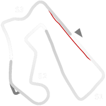
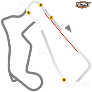

# 🏁 Track Info

Road Americais a motorsport road course located near Elkhart Lake, Wisconsin. It has hosted races since the 1950s and currently hosts races in the IndyCar Series, IMSA SportsCar Championship, Sports Car Club of America, GT World Challenge America and Trans-Am Series.[1]

---

---

