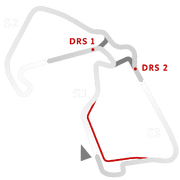
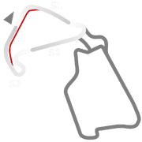

# 🏁 Track Info

Silverstone Circuitis a motor racing circuit in England, near the Northamptonshire villages of Silverstone and Whittlebury. It is the home of the British Grand Prix, which it first hosted as the 1948 British Grand Prix.[1]

---

---

